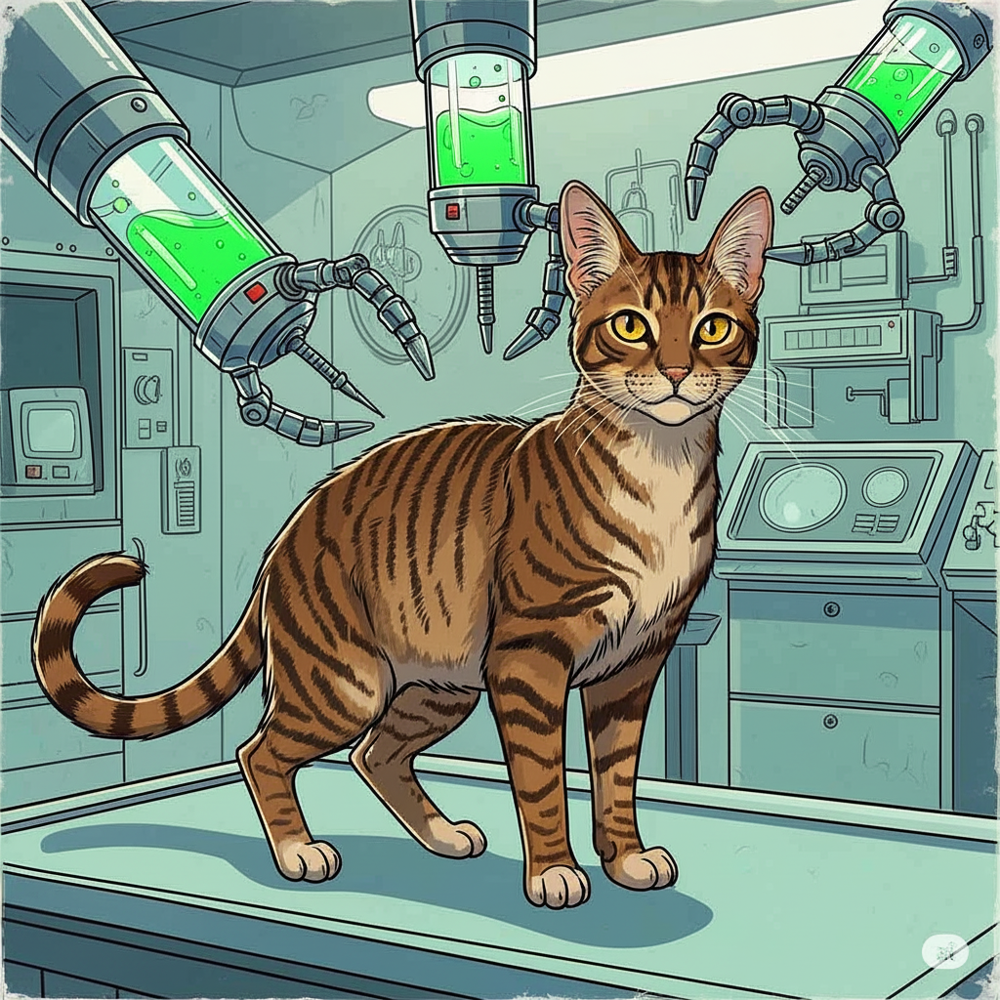

# MartianCorp™ DFCU Care Document 37-D (Handbook)

## Introduction and Supplies

This operational handbook is **NOT** a replacement for training program 37-F. If you have not previously attended IN-PERSON 37-F training, and are not in possession of certification of the same, your possession of this document constitutes a felony under section C of the vault constituent protocol accord. Access to this document is tracked by live personnel.

**If you hate fun, just read the bold text.**

☢️ **Seriously: Champagne has cancer, and takes chemo to manage it. What this means for you is that anything that comes out of his body, you must handle with gloves. No exceptions. The gloves are in the guest bathroom, in the drawer under the sink.**

Anything means: Poop, Pee, Puke, Etc. You get it.

Greetings, valued MartianCorp™ Technician! Thank you for accepting this vital assignment – the stabilization and optimization of our cherished feline, Champagne (AKA Domestic Feline Control Unit, AKA DFCU)! As you're undoubtedly aware, Champagne is a singularly remarkable floofernutter, possessing a few… specialized requirements and a naturally reticent nature. 
However, he's a remarkably intelligent little friend, and will no doubt appreciate your diligent efforts to maintain his peak operational status while Dan and Martha are engaged in critical data collection assignments.

Your precise and systematic approach will ensure Champagne's continued functionality and contribute significantly to the overall harmony of our Domestic Feline Control Unit (DFCU) matrix. Let's get to work, and ensure a flawlessly synchronized future– together!™©

**And don't forget. Champagne is "Always a Good Boy!"™**

### **Emergencies**

**Champagne is a healthy cat. But if anything does happen, and you need to take him to the vet, the nearest emergency vet is [GoodVets Downtown Brooklyn](https://maps.app.goo.gl/8zSrXM3DYqJGNhsj8). His carrier is in the guest room closet, on the right.**

#### **Vet Locations**
*   [GoodVets Downtown Brooklyn](https://maps.app.goo.gl/8zSrXM3DYqJGNhsj8) - Close by
*   [VERG](https://maps.app.goo.gl/LLyGA9AjzXJ6NuQi7) - Current vet, but a bit further

## Supply Depots

All supplies you could ever need (and more!) are available in the three supply depot locations, for your convenience. Here's a [non-exhaustive] list of available items at the supply depots:

### Entrance Supply Depot
On the right-most door of the credenza by the entrance
*   **Food (F.O.O.D.)**
    *   **Dry - in canister, with scoop**
    *   **Wet (W.F.O.O.D.) - in serving containers**
    *   **Treats (D.F.O.O.D.) - In branded baggies**
*   **Medicine**
    *   **Mirataz cream, for appetite. Just use this and ignore the others. Do not get any on your skin, because it works on humans and will actually trigger your appetite.**
    *   **Alura liquid, alternative for appetite. Mix with Churu and supervise while eating**
    *   **Mirataz pill, alternative for appetite. Administer a FLAKE of it orally**

### Bathroom Supply Depot
Under the guest bathroom sink
*   **Gloves (May be on top of the litter box)**
*   **Poop bags for cleaning the litter box**

### Kitchen Supply Depot
Under the kitchen sink
*   **Cleaning supplies**

## F.O.O.D.™ Fuel

### Dry

There's nothing that Champagne and his trusty DFCU matrix appreciate more than a heaping bowl of dry F.O.O.D. That's right– **F**issile **O**smium-188 **O**rally-administered **D**igestibles. YUM!

MartianCorp technicians have developed a DFCU-specialized F.O.O.D. delivery system that ensures controlled intake of fuel. We just call it his B.O.W.L. Heh! **Fresh F.O.O.D. can be acquired at the Entrance Supply Depository. Just make sure Champagne's food bowls are full, and he'll take it from there! Woah there, Champers! Save some F.O.O.D. for the rest of us!**

### Wet

What makes F.O.O.D. go down even easier than a scrumptious side of W.F.O.O.D.? What's W.F.O.O.D.? Why it's the same fuel your DFCU trusts, but with a little "Wet" Deuterium to "lighten" things up! Now that's a "heavy" meal!

**W.F.O.O.D. is administered once per sun-cycle.**

1.  **Start by removing the W.F.O.O.D. dish from Champagne's W.F.O.O.D. automator by pushing the white button on the front.**
2.  **Clean off any W.F.O.O.D. from the previous sun-cycle with a damp paper towel**
3.  **Plop in the contents of one W.F.O.O.D. serving pack**
4.  **Fill *half* of the now-empty W.F.O.O.D. serving pack with water and pour that in with the W.F.O.O.D.**
5.  **Mush that together into a paste.** Yum.

### D.F.O.O.D. (Discretionary F.O.O.D., or Treats™!)

Champagne is "Always a Good Boy!"™ so we like to reward him with the D.F.O.O.D. he likes best! Compared to the other MartianCorp DFCUs, Champagne's Situational Awareness and Response protocol subsystems are a bit more finely honed, making him, let's just say, a more "hesitant" customer.

If he doesn't come right away when you offer him a D.F.O.O.D. (or three 🤣) just leave it on the floor, where he can detect it with his optical sensor array, and he'll scoop it up right when you look away. Woah, where'd it go??

### Water

No mystery here! DFCUs get hot hot hot, and need a constant supply of coolant to run smooth as butter. That's why Champagne has three B.O.W.L.s for water. One under the stool in the master bedroom, one in the living room beside the master bedroom door, and one under the round table in the guest room.

**Each day, change Champagne's Coolant (water) by just clearing and refilling each of his water B.O.W.L.s. with fresh filtered water! (Filter on the kitchen counter)**

## Medicine

As we love to say, Champagne is a unique DFCU. He just needs some extra maintenance for smooth operation. But we stand by our pledge. Say it with us! He's "Always a Good Boy!"™

### Appetite meds - Mirataz

**Don't get Mirataz on your skin. Just treat it like you would any medication you were giving to another person.**

Because of the Chemo Champagne takes, he can have trouble keeping up his enthusiasm for F.O.O.D., W.F.O.O.D. and D.F.O.O.D. So we do it for him with Mirataz™brand ear ointment (available in the Supply Depot)

**Mirataz is administered every 48 hours (loosely) and can be found in the entrance supply depot.**

#### Administration
1.  **Put gloves on both hands. Gloves can be acquired in the Bathroom Supply Depot.**
2.  **Apply a line of Mirataz about half an inch long to your gloved finger.**
3.  **Gently rub the Mirataz into Champagne's inner ear flap. Avoid getting it on his fur.**
4.  **Discard gloves immediately after administration**
5.  **Wash hands thoroughly with soap and water.**

### Chemotherapy

You will almost definitely not be asked to give Champagne his Chemo. But just in case, it's in the refrigerator, and is a single pill.

**Don't start handling the Chemo (even the bag itself) without gloves on.**

#### Administration

1. Put gloves on both hands. Gloves can be acquired in the Bathroom Supply Depot.
2. Retrieve chemo pill bag from the refrigerator.
3. The pills are in individual pill envelopes in the bag. Remove a pill from the bag.
4. Hold champagne to your belly, with his back to you. Use your legs to gently restrain him.
5. Pull his head back gently. When his head is far back enough, he will open his mouth. Quickly place the pill as far back into his mouth as you are able.
6. Don't let him go right away. You may need to hold his mouth shut for a moment, and you'll notice him swallowing.
7. Let him go. He will absolutely hide.